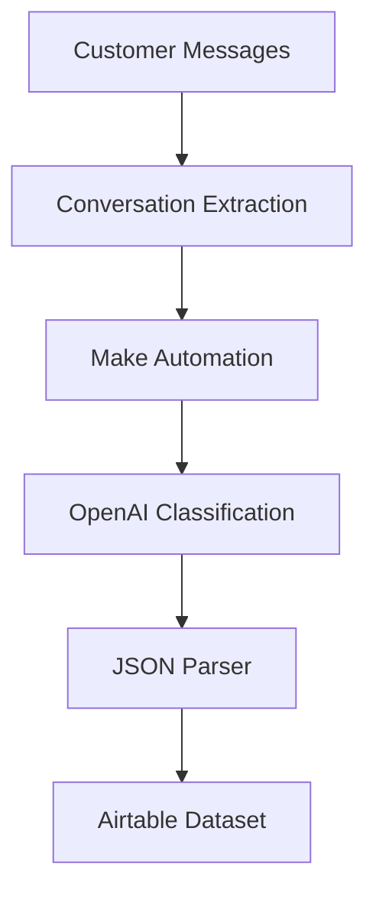

# System Architecture

## Data Flow

WhatsApp Web  
↓  
Chrome Extraction Script  
↓  
JSON Conversation Export  
↓  
Make.com Webhook  
↓  
OpenAI Classification  
↓  
JSON Parser  
↓  
Iterator  
↓  
Airtable Dataset

## Pipeline Diagram

